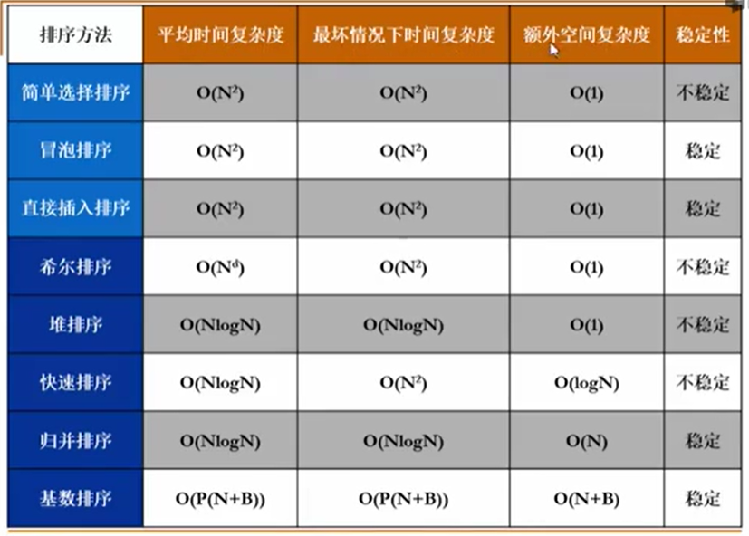
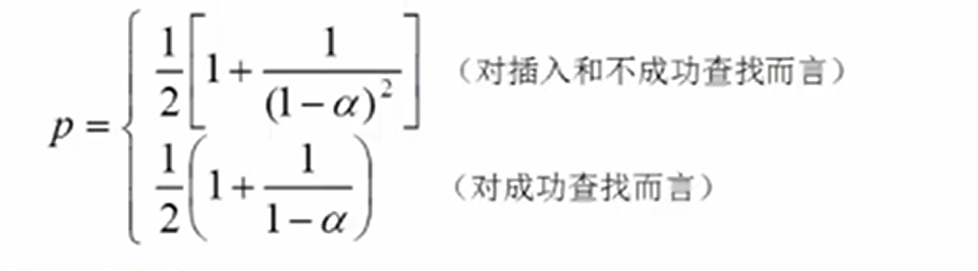
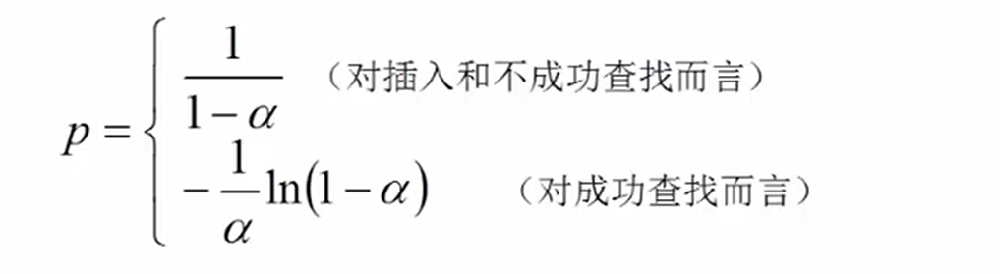
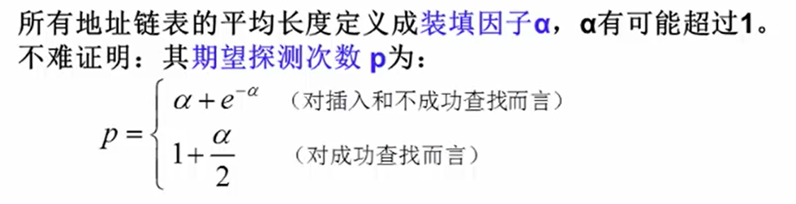

#### 排序

+ 简单选择排序
+ 冒泡排序
+ 直接插入排序
+ 希尔排序
+ 堆排序

+ 归并排序
  
+ 递归/非递归
  
+ 快速排序
  + 选主元（选三个数的中位数）
  + 子集划分 （等于pivot，停下来交换O(N log N))
  + 小规模不用快速排序
+ 表排序
  + 适用于复杂结构体
  + 简介排序（table储存指针）
  + 判断环结束table[ i ] = i

+ 基数排序

  + 桶排序
  + 基数排序
    + 次位优先（Least Significant Digit）
    + 主位优先（Most Significant Digit)
    + 多关键字排序

+ 排序算法的比较

  ​			

  

#### 散列查找

+ 散列表 
  + 计算位置 + 解决冲突
  + 散列函数
  + 装填因子（Loading Factor）
  
+ 散列函数的构造
  1. 直接定址法
  2. 除留余数法（p一般取素数） 
  3. 数字分析法
  4. 折叠法
  5. 平方取中法
  6. 字符构造
     1. ASCII码加和法
     2. 前三个字符位移法（27）
     3. 移位法（32：左移五位）
  
+ 冲突处理的方法

  + 开放地址法
    + 线性探测（"聚集"问题），平方探测（+-i^2)(4K + 3可以避免找不到空间)，双散列(两个散列函数p-key mod ...)
    + 成功平均查找长度(ASLu)，不成功平均查找长度(ASLu)  
    + 再散列（Rehashing）（装填因子0.5-0.85）
  + 链地址法
    + 分离链接法

+ 性能分析

  + ASL（次数）：成功/不成功

  + 影响因素：

    + 散列函数均匀
    + 处理冲突方法
    + 填充因子大小（不超过0.85)

  + 线性探测法

    

  + 平方探测法和双散列探测法

    

  + 分离链接法

    

+ 特点

  + 查找效率期望是常数
  + 以空间换时间
  + 随机存储，不便于顺序查找关键字，也不适合范围查找，或最大值最小值查找

+ 开放地址法/分离链接法

  + 开放地址法：快，易聚集
  + 分离链接法：存储效率和查找效率都低